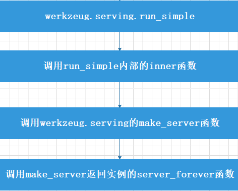

# `flask`流程分析
>  
首先我们先来看一个简单的flask应用:  
```python
from flask import Flask

app = Flask(__name__)

@app.route("/")
def hello():
    return "Hello, World!"
if __name__ == "__main__":
    app.run()
```

从flask src/flask/__init__.py可知，Flask类来自app.py，我摘取关键的逻辑代码看一下：
```python
class Flask(_PackageBoundObject):
    def __init__(
        self,
        import_name,
        static_url_path=None,
        static_folder="static",
        static_host=None,
        host_matching=False,
        subdomain_matching=False,
        template_folder="templates",
        instance_path=None,
        instance_relative_config=False,
        root_path=None,
    ): 
        self.view_functions = {}
        """
        此处省略若干行，主要是一些初始化的操作
        """

    def run(self, host=None, port=None, debug=None, load_dotenv=True, **options):
         """
         省略其他干扰逻辑，看主要的逻辑
         """

        _host = "127.0.0.1"
        _port = 5000
        server_name = self.config.get("SERVER_NAME")
        sn_host, sn_port = None, None

        if server_name:
            sn_host, _, sn_port = server_name.partition(":")

        host = host or sn_host or _host
        port = int(next((p for p in (port, sn_port) if p is not None), _port))

        from werkzeug.serving import run_simple

        try:
            run_simple(host, port, self, **options)
        finally:
            self._got_first_request = False

    def route(self, rule, **options):

        def decorator(f):
            endpoint = options.pop("endpoint", None)
            self.add_url_rule(rule, endpoint, f, **options)
            return f

        return decorator

    def wsgi_app(self, environ, start_response):
        ctx = self.request_context(environ)
        error = None
        try:
            try:
                ctx.push()
                response = self.full_dispatch_request()
            except Exception as e:
                error = e
                response = self.handle_exception(e)
            except:  # noqa: B001
                error = sys.exc_info()[1]
                raise
            return response(environ, start_response)
        finally:
            if self.should_ignore_error(error):
                error = None
            ctx.auto_pop(error)

    def __call__(self, environ, start_response):

        return self.wsgi_app(environ, start_response)

```
>
从代码可知，app.run调用werkzeug.serving的run_sample，并把host、port、self(app的实例)等参数传递给run_sample。后续的wsgi逻辑都在werkzeug里处理，说起werkzeug，不得不说这是flask作者的又一大基础库，它用于wsgi应用程序的各种实用工具的集合，现在已经成为最先进的wsgi实用库之一。Flask封装Werkzeug，用它来处理WSGI的细节，同时通过提供更多的结构和模式来定义强大的web应用。  
下面就用流程图，简单看一下werkzeug内部的调用逻辑：  



参考文档：  
* [werkzeug](https://palletsprojects.com/p/werkzeug/)
